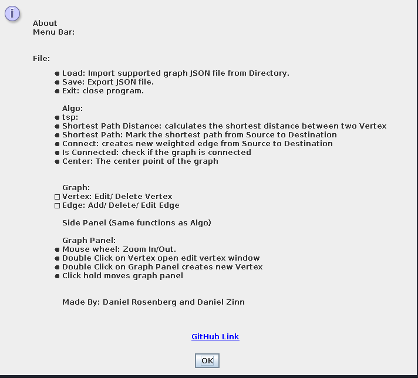

## Ex2 OOP class - ariel CS

In this assigment we were given the following interfaces:

| Interface                       | Description                                                        |
|---------------------------------|--------------------------------------------------------------------|
| EdgeData                        | This interface represents a grpah edge                             |
| NodeData                        | This interface represents a grpah node                             |
| GeoLocation                     | This interface represents a point in 3D space                      |
| DirectedWeightedGraphAlgorithms | This interface allows us to run some basic algorithms on our graph |
| DirectedWeightedGraph           | This interface represents a directed weighted grpah                |

We were also given an `Ex2.java` file with some static methods to test our project with.

## Folder Structure

The workspace contains two folders by default, where:

- `src`: the folder to maintain sources
    - `main/java/GUI`: the folder where all the Gui related files are 
    - `main/java/api`: the folder where the given interfaces are located
    - `main/java/implentations`: the folder where the implementation of all the interfaces are (and some more)
    - `test/java/implentations`: the folder where all the tests are located in
- `data`: the folder which contains all of our graphs are 
- 'out' : a folder with an executable jar file

## Testing
this project was test using the JUINT5 library. the tests can be run by an IDE of choice.

## Running the program
The project was built using maven, clone this project with intellij, download the required dependencies using maven and run
`Ex2`

or running the jar file:

    git clone https://github.com/Daniel-Ros/OOP3.git
    cd OOP3/out/artifacts/Ex2_jar/
    java -jar Ex2.jar PATH_TO_JSON.json

once you are in the gui you can:
- use the mouse to move the graph around the window area
- use the scroll to zoom in and out
- double-click in empty area to create new node
- double-click on a node to edit a node
- right-click on a node to delete it
- left-click a node to select it as src
  - the second time you will click a node it will select the node as dest
  - left-click on an empty area to reset the selection
- you and run any of the given algorithms, each with its own parameters and results
- you can run algorithms from the menu
- you can edit the graph from the menu

## images
tsp:

zoom:

node edit:

about:

##  Results

These are the final results that I was able to get

| size   | algorithm        | time to finish in Millisecons |
|--------|------------------|-------------------------------|
 | 1000   | isConnected      | 66                            |
 | 1000   | shortestPath     | 45                            |
 | 1000   | shortestPathDist | 26                            |
 | 1000   | center           | 1703                          |
 | 1000   | tsp              | 36                            |
 | 10000  | isConnected      | 551                           |
 | 10000  | shortestPath     | 342                           |
 | 10000  | shortestPathDist | 274                           |
 | 10000  | tsp              | 1124                          |
 | 10000  | center           | 529873                        |
 | 100000 | isConnected      | 8095                          |
 | 100000 | shortestPath     | 5500                          |
 | 100000 | shortestPathDist | 5419                          |
 | 100000 | tsp              | 27946                         |
 | 100000 | center           | > 30 min                      |

## Assigment Instructions
[here](https://docs.google.com/document/d/17h5VGIHtqWHrzgoRjH05_PjHgCn8-EDcecrkR9sVChQ/edit)